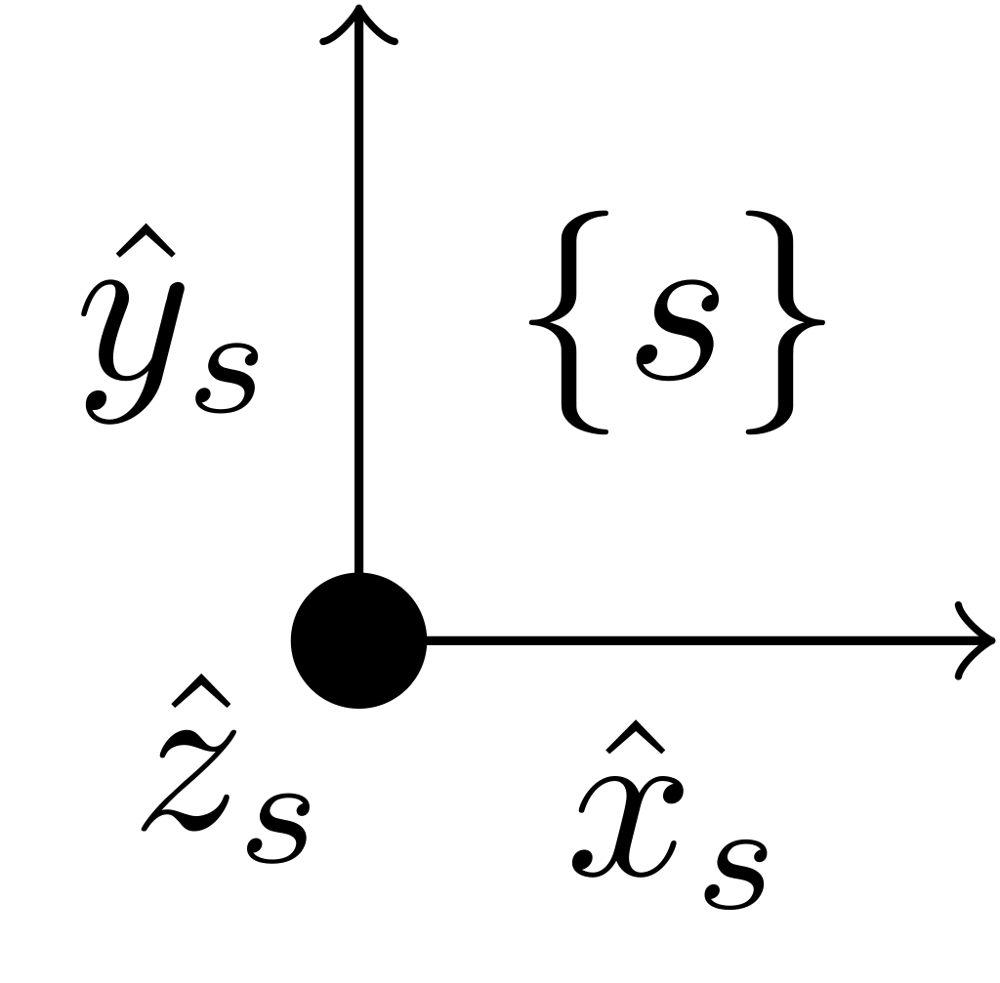
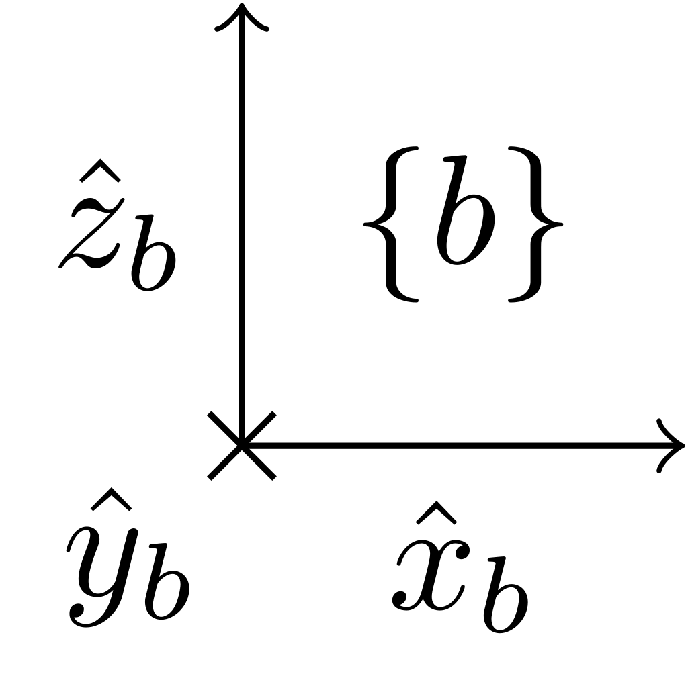
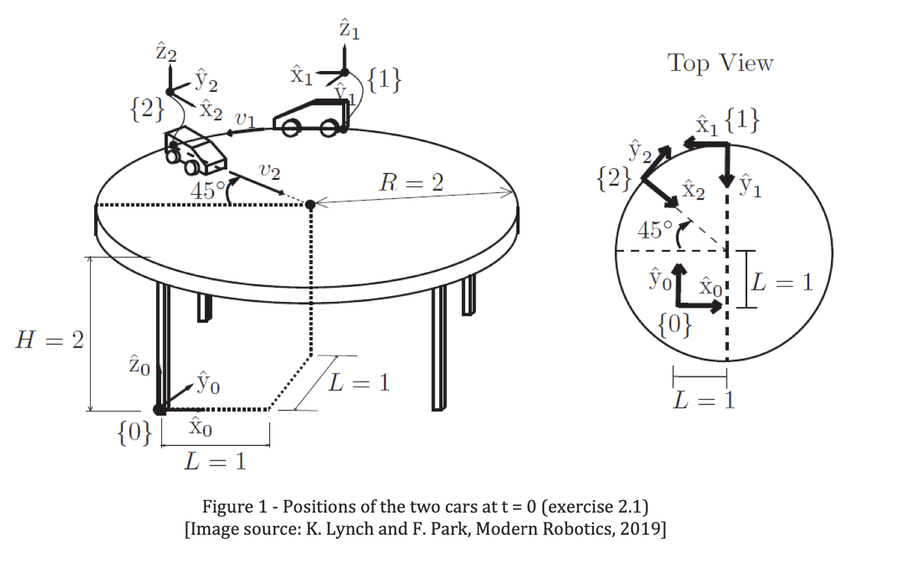

# METR4202
## Robotics & Automation
### TUT 2: Tutorial - Rigid-body Motions

---

# Representing Rotations as Matrices
## Rotations in 2D
$$
R =
\begin{bmatrix}
\cos{(\theta)} & -\sin{(\theta)} \\
\sin{(\theta)} & \cos{(\theta)}
\end{bmatrix}
$$
---
## Rotations in 3D
$$
R(\theta_{x},\theta_{y},\theta_{z})=R_{x}(\theta_{x})R_{y}(\theta_{y})R_{z}(\theta_{z})
$$
$$
R_{x}(\theta_{x})=
\begin{bmatrix}
\cos{(\theta_{x})} & -\sin{(\theta_{x})} & 0 \\
\sin{(\theta_{x})} & \cos{(\theta_{x})} & 0 \\
0 & 0 & 1
\end{bmatrix}
$$
$$
R_y(\theta_{y}) =
\begin{bmatrix}
\cos{(\theta_{y})} & 0 & \sin{(\theta_{y})} \\
0 & 1 & 0 \\
-\sin{(\theta_{y})} & 0 & \cos{(\theta_{y})}
\end{bmatrix}
$$
$$
R_z(\theta_{z}) =
\begin{bmatrix}
1 & 0 & 0 \\
0 & \cos{(\theta_{z})} & -\sin{(\theta_{z})} \\
0 & \sin{(\theta_{z})} & \cos{(\theta_{z})}
\end{bmatrix}
$$

---

## Rotations in 3D
### Representations in METR4202
- Special Orthogonal Group: $\mathrm{SO}(3)$
$$
R\in \mathrm{SO}(3)\subset R^{3\times 3} \\
\mathrm{SO}(3):\{R\in R^{3\times 3} | R^{\top}R=I\wedge \det{(R)}=1 \}
$$

---

### Other representations? (not assessable)
- Unit Quaternions: $\hat{\mathbb{H}}$
$$
\hat{\mathbb{H}}:\{q=a+bi+cj+dk\in \mathbb{H}|q^{*}q=a^{2}+b^{2}+c^{2}+d^{2}=1\}
$$
- 2x2 Unitary Matrices: $\mathrm{SU}(2)$
$$
\mathrm{SU(2)}:\left\{U\in\mathbb{C}^{2\times 2}|
U^{H}U=I\wedge \left|\det{(U)}\right|=1\right\}
$$
$$
U=
\begin{bmatrix}
a+bi & c+di \\
-c + di & a - bi
\end{bmatrix},
$$

---
$$
\mathrm{SO}(3)\cong \hat{\mathbb{H}} \cong \mathrm{SU}(3)
$$

$$
\text{SO(3)}\underbrace{\longleftrightarrow}_{\text{isomorphic}}\text{Unit Quaternions}\underbrace{\longleftrightarrow}_{\text{isomorphic}}\text{SU(2)}
$$
- Note: all of these are equivalent to each other and represent the same topological spaces.
- In METR4202, you will mostly use the $\mathrm{SO}(3)$ representation.
- Most software implementations of rotations use quaternions for the time and space advantages, since it requires fewer variables and is easy to normalise which $SO(3)$ lacks.
- However, quaternions and $\mathrm{SU}(2)$ are not assessable for the course.

---

# Exercise 1: Basics of Rotation Matrices

Exercise 3.1, Modern Robotics, K. Lynch & F. Park, 2019

In terms of the $\hat{x}_{s},\hat{y}_{s},\hat{z}_{s}$ coordinates of a fixed *space* frame $\{s\}$
- The frame $\{a\}$ has
  - The $\hat{x}_{a}$-axis pointing in the direction $\begin{bmatrix}0 & 0 & 1\end{bmatrix}^{\top}$
  - The $\hat{y}_{a}$-axis pointing in the direction $\begin{bmatrix}-1 & 0 & 0\end{bmatrix}^{\top}$
- The frame $\{b\} gas
  - The $\hat{x}_{b}$-axis pointing in the direction $\begin{bmatrix}1 & 0 & 0\end{bmatrix}^{\top}$
  - The $\hat{y}_{b}$-axis pointing in the direction $\begin{bmatrix}0 & 0 & -1\end{bmatrix}^{\top}$

---

## Questions

### Question 1a)
Draw the three frames by hand (Note: frame origins can be anywhere)

---

### Answer 1a)

---

### Question 1b)
Write down the rotation matrices $R_{sa}$ and $R_{sb}$

---

### Solution 1b)

We can think of the rotation matrices as a transformation from set of basis vectors to another set of basis vectors.

$$
\underline{\mathbf{R}}_{a}=\underline{\mathbf{R}}_{s}R_{sa}
$$

$$
\begin{bmatrix}\hat{x}_{a}|\hat{y}_{a}|\hat{z}_{a}\end{bmatrix}=\begin{bmatrix}\hat{x}_{s}|\hat{y}_{s}|\hat{z}_{s}\end{bmatrix}R_{sa}
$$

$$
\begin{cases}
\hat{x}_{a} &= \hat{z}_{s}\\
\hat{y}_{a} &= -\hat{x}_{s}\\
\hat{z}_{a} &= -\hat{y}_{s}\\
\end{cases},\quad
\begin{cases}
\hat{x}_{b} &= \hat{x}_{s}\\
\hat{y}_{b} &= -\hat{z}_{s}\\
\hat{z}_{b} &= \hat{y}_{s}\\
\end{cases}
$$

---
For $R_{sa}$
$$
\hat{x}_{a} =
\begin{bmatrix}
\hat{x}_{s} | \hat{y}_{s} | \hat{z}_{s}
\end{bmatrix}
\begin{bmatrix}
0 \\ 0 \\ 1
\end{bmatrix},
\hat{y}_{a} =
\begin{bmatrix}
\hat{x}_{s} | \hat{y}_{s} | \hat{z}_{s}
\end{bmatrix}
\begin{bmatrix}
-1 \\ 0 \\ 0
\end{bmatrix},
\hat{z}_{a} =
\begin{bmatrix}
\hat{x}_{s} | \hat{y}_{s} | \hat{z}_{s}
\end{bmatrix}
\begin{bmatrix}
0 \\ -1 \\ 0
\end{bmatrix}
$$

$$
\begin{bmatrix}\hat{x}_{a}|\hat{y}_{a}|\hat{z}_{a}\end{bmatrix}=\begin{bmatrix}\hat{x}_{s}|\hat{y}_{s}|\hat{z}_{s}\end{bmatrix}
\begin{bmatrix}
0 & -1 & 0 \\ 0 & 0 & -1 \\ 1 & 0 & 0
\end{bmatrix}
$$

$$
R_{sa}=
\begin{bmatrix}
0 & -1 & 0 \\ 0 & 0 & -1 \\ 1 & 0 & 0
\end{bmatrix}
$$

---

For $R_{sb}$
$$
\hat{x}_{b} =
\begin{bmatrix}
\hat{x}_{s} | \hat{y}_{s} | \hat{z}_{s}
\end{bmatrix}
\begin{bmatrix}
1 \\ 0 \\ 0
\end{bmatrix},
\hat{y}_{b} =
\begin{bmatrix}
\hat{x}_{s} | \hat{y}_{s} | \hat{z}_{s}
\end{bmatrix}
\begin{bmatrix}
0 \\ 0 \\ -1
\end{bmatrix},
\hat{z}_{b} =
\begin{bmatrix}
\hat{x}_{s} | \hat{y}_{s} | \hat{z}_{s}
\end{bmatrix}
\begin{bmatrix}
0 \\ 1 \\ 0
\end{bmatrix}
$$

$$
\begin{bmatrix}\hat{x}_{b}|\hat{y}_{b}|\hat{z}_{b}\end{bmatrix}=\begin{bmatrix}\hat{x}_{s}|\hat{y}_{s}|\hat{z}_{s}\end{bmatrix}
\begin{bmatrix}
1 & 0 & 0 \\ 0 & 0 & 1 \\ 0 & -1 & 0
\end{bmatrix}
$$

$$
R_{sb}=
\begin{bmatrix}
1 & 0 & 0 \\ 0 & 0 & 1 \\ 0 & -1 & 0
\end{bmatrix}
$$
---

### Question 1c)
Given $R_{sa}$, how do you easily calculate $R^{-1}_{sb}$ without calculating the standard matrix inverse?

---

### Answer 1c)

Since $R_{sa}$ is a rotation matrix, it must satisfy the constraint:

$$
R_{sa}^{\top}R_{sa}=I
$$
Therefore, we can calculate the inverse as:
$$
R_{sa}^{-1}=R_{sa}^{\top}
$$

$$
R_{sa}^{-1}=R_{sa}^{\top}=
\begin{bmatrix}
0 & -1 & 0 \\ 0 & 0 & -1 \\ 1 & 0 & 0
\end{bmatrix}^{\top}=
\begin{bmatrix}
0 & 0 & 1 \\ -1 & 0 & 0 \\ 0 & -1 & 0
\end{bmatrix}
$$
 
---

### Question 1d)
Given $R_{sa}$ and $R_{sb}$, how can you calculate $R_{ab}$?

---

### Answer 1d)
We know the following:
$$
\underline{\mathbf{R}}_{a}=\underline{\mathbf{R}}_{s}R_{sa}
$$

$$
\underline{\mathbf{R}}_{b}=\underline{\mathbf{R}}_{s}R_{sb}
$$
We want to calculate:

$$
\underline{\mathbf{R}}_{b}=\underline{\mathbf{R}}_{a}R_{ab}
$$
So, we can rearrange the equations:

$$
\underline{\mathbf{R}}_{s}=\underline{\mathbf{R}}_{a}R_{sa}^{\top}
$$

$$
\underline{\mathbf{R}}_{b}=\underline{\mathbf{R}}_{a}R_{sa}^{\top}R_{sb}
$$

$$
\Rightarrow R_{ab}=R_{sa}^{\top}R_{sb}
$$

---

### Question 1e)
- Let $R=e^{\theta[\hat{x}]}$ be considered as a transformation operator consisting of a rotation about $\hat{x}$ by $\theta=-90\degree$.
$$ R=e^{\theta[\hat{x}]}=
\begin{bmatrix}
1 & 0 & 0 \\ 0 & 0 & 1 \\ 0 & -1 & 0
\end{bmatrix}
$$
- The rotation matrix $R$ is defined without a particular basis in mind.
- Calculate $R_{1}=R_{sa}R$ and think of:
  - $R_{sa}$ as a representation of an **orientation**,
  - $R$ as a representation of a **rotation transformation**
  - $R_{1}$ as a **transformed orientation**.

---
### Answer 1e-i)
It helps to think of this in the basis of $\underline{\mathbf{R}}_{s}$
Then, $R_{sa}$ is the representation of the frame $\{a\}$ in the the coordinates of $\{s\}$.
$$
\underline{\mathbf{R}}_{s}R_{1}=\underline{\mathbf{R}}_{s}R_{sa}e^{\theta[\hat{x}]}=\underline{\mathbf{R}}_{a}e^{\theta[\hat{x}]}=e^{\theta[\hat{x}_{a}]}
$$
$R_{1}$ is the representation of the transformed frame $\{a\}$ in the the coordinates of $\{s\}$, which is transformed by rotating about the *body*-fixed axis $\hat{x}_{a}$

---

### Question 1e) part 2:
- Let $R$ be considered as the same transformation operator consisting of a rotation about $\hat{x}$ by $-90\degree$.
- Calculate $R_{2}=RR_{sa}$ and think of:
  - $R_{sa}$ as a representation of an **orientation**,
  - $R$ as a representation of a **rotation transformation**
  - $R_{2}$ as a **transformed orientation**.

---

### Answer 1e-ii)
$$
R_{2}=e^{\theta[\hat{x}]}R_{sa}
$$
$$
\underline{\mathbf{R}}_{s}R_{2}=\underline{\mathbf{R}}_{s}e^{\theta[\hat{x}]}R_{sa}
$$

$$
\underline{\mathbf{R}}_{s}R_{2}=\left(\underline{\mathbf{R}}_{s}e^{\theta[\hat{x}]}\right)R_{sa}
$$

$$
\underline{\mathbf{R}}_{s}R_{2}=
e^{\theta[\hat{x}_{s}]}R_{sa}
$$
The way to interpret this is is that the orientation $R_{sa}$, is the frame $\{a\}$ expressed in the coordinate system of $\{s\}$ is being rotated about the *fixed*-frame $\{s\}$, through the rotation $e^{\theta[\hat{x}_{s}]}$, which is equal to the orientation $R_{2}$, which is expressed in the fixed frame $\{s\}$.

---

# Question 1f)
- Use $R_{sb}$ to change the representation of the point $p_{b}=\begin{bmatrix}1 & 2 & 3\end{bmatrix}^{\top}$ from the $\{b\}$ frame to the representation in the $\{s\}$ frame.
  - Note: we are not transforming the point, only changing the representation. ($[p_{b}]_{\{b\}}\rightarrow[p_{s}]_{\{s\}}$)
  - This is the same as a change of basis (Recall MATH2000/2001).

---
# Solution 1f)
- We can use the following:
$$
p_{s}=R_{sb}p_{b}
$$
- We use the rotation from the $\{s\}$ frame to the $\{b\}$ frame, to change the *representation* of the point $p$ from the $\{b\}$ frame to the $\{s\}$ frame.
- For more explanation see:
  - Change of basis, 3Blue1Brown:
  https://youtu.be/P2LTAUO1TdA

---

# Exercise 1g)
- Choose a point represneted by $p_{s} = \begin{bmatrix}1 & 2 & 3\end{bmatrix}^{\top}$
- Calculate $p'=R_{sb}p_{s}$
  - How do we interpret the result of this?
  - Is this a change of coordinates or a transformation of a point within a certain frame?
- Calculate $p''=R_{sb}^{\top}p_{s}$
  - How do we interpret the result of this?
  - Is this a change of coordinates or a transformation of a point within a certain frame?

---

# Angular Velocities
- An angular velocity (in 3D) is a 'pseudo-vector'
  - For the purposes of robotics, and in this course, you can treat it as a vector.
  - In 2D, we usually treat it as a scalar about the axis perpendicular to the plane, and for an angle theta, we have $\omega=\dot{\theta}$
- It defines the instantaneous rate at which an object rotates about a particular axis.
- Like other vectors such as position and velocity, it needs to be defined with respect to a reference frame.
- We typically use $\omega$ (vector) to represent angular velocity, and $\hat{\omega}$ to represent the axis of rotation, such that: $\omega=\hat{\omega}\dot{\theta}$

---

# Exercise 1h)
- An angular velocity $\omega$ is represented in $\{s\}$ as $\omega_{s} = \begin{bmatrix}3 & 2 & 1\end{bmatrix}^{\top}$
- What is its representation $\omega_{a}$ in $\{a\}$?

- *(from Q1)* In terms of the $\hat{x}_{s},\hat{y}_{s},\hat{z}_{s}$ coordinates of a fixed *space* frame $\{s\}$
  - The frame $\{a\}$ has
    - The $\hat{x}_{a}$-axis pointing in the direction $\begin{bmatrix}0 & 0 & 1\end{bmatrix}^{\top}$
    - The $\hat{y}_{a}$-axis pointing in the direction $\begin{bmatrix}-1 & 0 & 0\end{bmatrix}^{\top}$

---

# Matrix Logarithm
$$
[\hat{\omega}]=
\begin{bmatrix}
0 & -\hat{\omega}_{3} & \hat{\omega}_{2} \\
\hat{\omega}_{3} & 0 & -\hat{\omega}_{1} \\
-\hat{\omega}_{2} & \hat{\omega}_{1} & 0
\end{bmatrix}=\frac{1}{2\sin{(\theta)}}\left(R-R^{\top}\right)
$$
$$\theta=\mathrm{arccos}\left(\frac{\mathrm{tr}(R)-1}{2}\right)$$

---

# Exercise 1i)
- By hand, calculate the matrix logarithm $[\hat{\omega}]\theta$ of $R_{sa}$.
- Extract the unit angular velocity $\hat{\omega}$ and the rotation angle $\theta$.

---

# Matrix Exponentials
## Rodrigues' Formula:
$$
R(\hat{\omega},\theta)=e^{[\hat{\omega}]\theta}=I+\sin{(\theta)}[\hat{\omega}]+\left(1-\cos{(\theta)}\right)[\hat{\omega}]^{2}
$$

---

# Exercise 1j)
- Calculate the matrix exponential corresponding to the exponential coordinates of rotation $\hat{\omega}\theta=\begin{bmatrix}1 & 2 & 0\end{bmatrix}^{\top}$

---

# Transformations
$$
T =
\begin{bmatrix}
R & p \\
0 & 1
\end{bmatrix}\in \mathrm{SE}(3),\quad R\in SO(3),\quad p\in\mathbb{R}^{3}
$$
$$
T^{-1} = \begin{bmatrix}
R^{\top} & -R^{\top}p \\
0 & 1
\end{bmatrix}
$$

---

# Exercise 2: Rigid-body motions
- a) Find $T_{01}$ and $T_{02}$ as a function of time $t$
- b) Find $T_{12}$ as a function of time $t$

---

# Bonus!
For some cool python libraries about screw theory check out this GitHub repo by Raghav Mishra (and me)

### https://github.com/LaVieEstDure/ScrewRobotics