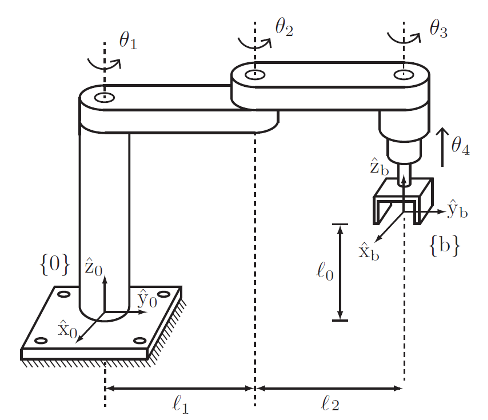
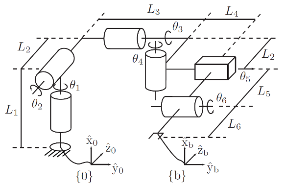

# METR4202
## Robotics & Automation
### Tutorial 3 - Forward Kinematics

---

# Exercise 1: Product of Exponentials


---




---
### Forward Kinematics
We first need to calculate the transformation from the $\{s\}$ frame to the $\{b\}$ frame of the robot, while it is in the zero configuration / home position.
$$
M_{sb} = T_{sb}(\theta=0)
$$
$$
\begin{aligned}
T_{sb}(\theta) &= \left(\prod_{i=1}^{n}e^{[\mathcal{S}_{i}]\theta_{i}}\right)M_{sb} \\
T_{sb}(\theta) &= e^{[\mathcal{S}_{1}]\theta_{1}}\cdots e^{[\mathcal{S}_{n}]\theta_{n}}M_{sb} \\
\end{aligned}
$$

---

## Step 1: Find the screw axes $\mathcal{S}_{i}$

---

### Joint 1:

$$
\begin{aligned}
\mathcal{S}_{2}&=(\hat{\omega}_{s1}, \hat{v}_{s1})\in \R^{6} \\
\hat{\boldsymbol{\omega}}_{s1}&= \hat{\mathbf{z}}_{0} &(\text{vector}) \\
\hat{\omega}_{s1}&= (0, 0, 1) & (\text{coordinates in $\{s\}=\{0\}$})  \\
q_{1} &= (0, 0, \ell_{0}) \\
\hat{v}_{s1} &= -[\hat{\omega}_{s1}]q_{1} & (\text{skew matrix $\leftrightarrow$ cross product}) \\
&= -\hat{\omega}_{s1}\times q_{1} \\
&= -(0, 0, 1) \times (0, 0, \ell_{0}) \\
&= (0, 0, 0) & (\text{Note that $\ell_{0}$ is irrelevant}) \\
\mathcal{S}_{1} &= (0, 0, 1, 0, 0, 0)
\end{aligned}
$$

---

### Joint 2:

$$
\begin{aligned}
\mathcal{S}_{2}&=(\hat{\omega}_{s2}, \hat{v}_{s2})\in \R^{6} \\
\hat{\omega}_{s2}&= (0, 0, 1)\\
q_{2} &= (0, \ell_{1}, \ell_{0})\\
\hat{v}_{s2} &= -[\hat{\omega}_{s2}]q_{2}  \\
&= -\hat{\omega}_{s2}\times q_{2} \\
&= -(0, 0, 1) \times (0, \ell_{1}, \ell_{0}) \\
&= (\ell_{1}, 0, 0) \\
\mathcal{S}_{2} &= (0, 0, 1, \ell_{1}, 0, 0)
\end{aligned}
$$

---

### Joint 3:

$$
\begin{aligned}
\mathcal{S}_{3}&=(\hat{\omega}_{s3}, \hat{v}_{s3})\in \R^{6} \\
\hat{\omega}_{s3}&= (0, 0, 1)\\
q_{3} &= (0, \ell_{1}+\ell_{2}, \ell_{0})\\
\hat{v}_{s3} &= -[\hat{\omega}_{s3}]q_{3}  \\
&= -\hat{\omega}_{s3}\times q_{3} \\
&= -(0, 0, 1) \times (0, \ell_{1}+\ell_{2}, \ell_{0}) \\
&= (\ell_{1}+\ell_{2}, 0, 0) \\
\mathcal{S}_{3} &= (0, 0, 1, \ell_{1}+\ell_{2}, 0, 0)
\end{aligned}
$$

---

### Joint 4:

$$
\begin{aligned}
\mathcal{S}_{4}&=(\hat{\omega}_{s4}, \hat{v}_{s4})\in \R^{6} \\
\hat{\omega}_{s3}&= (0, 0, 0)\\\
\hat{v}_{s4} &= (0, 0, 1)  \\
\mathcal{S}_{4} &= (0, 0, 0, 0, 0, 1)
\end{aligned}
$$

---

### Home position / Zero configuration
We need to calculate the transformation from the space-frame (base) to the body-frame (end-effector)
$$\{s\}=\{0\}\rightarrow\{b\}=\{4\}$$


$$
M=M_{sb}=M_{0,4}=T(\theta=0)
$$
The frame axes are aligned, so we have:
$$
\hat{x}_{0}=\hat{x}_{4},\hat{y}_{0}=\hat{y}_{4},\hat{z}_{0}=\hat{z}_{4}\Rightarrow R_{0,4}=I
$$
In addition, the translation expressed in the $\{s\}$ frame is:
$$
\mathbf{p}_{0,4}=0\mathbf{\hat{x}}_{0}+\left(\ell_{1}+\ell_{2}\right)\mathbf{\hat{y}}_{0}+\ell_{0}\mathbf{\hat{z}}_{0}
$$
$$
\Rightarrow p_{0,4}=(0, \ell_{1}+\ell_{2},\ell_{0})
$$

---

$$
\begin{aligned}
M &= 
\begin{bmatrix}
R_{0,4} & p_{0,4} \\
0 & 1
\end{bmatrix} \\
 &=
\begin{bmatrix}
1 & 0 & 0 & 0 \\
0 & 1 & 0 & \ell_{1}+\ell_{2} \\
0 & 0 & 1 & \ell_{0} \\
0 & 0 & 0 & 1
\end{bmatrix}
\end{aligned}
$$

---
### Summary
We get the following screw axes:
$$
\begin{aligned}
\mathcal{S}_{1} &= (0, 0, 1, 0, 0, 0) \\
\mathcal{S}_{2} &= (0, 0, 1, \ell_{1}, 0, 0) \\
\mathcal{S}_{3} &= (0, 0, 1, \ell_{1}+\ell_{2}, 0, 0) \\
\mathcal{S}_{4} &= (0, 0, 0, 0, 0, 1)
\end{aligned}
$$
These are expressed in the coordinate system of the frame
$$
\{s\}=\{0\}\ \text{(space frame)}
$$


---

$$
T(\theta) = e^{[\mathcal{S}_{1}]\theta_{1}}e^{[\mathcal{S}_{2}]\theta_{2}}e^{[\mathcal{S}_{3}]\theta_{3}}e^{[\mathcal{S}_{4}]\theta_{4}}M
$$
---

$$
\begin{aligned}
e^{[\mathcal{S}]\theta} &=
\begin{bmatrix}
e^{[\hat{\omega}]\theta} & G_{\hat{\omega}}(\theta)\hat{v} \\
0 & 1
\end{bmatrix} \\
e^{[\omega]\theta} &= I + \sin{(\theta)}[\hat{\omega}]+\left(1 - \cos{(\theta)}\right)[\hat{\omega}]^{2} \\
G_{\hat{\omega}}(\theta) &= I\theta + (1 - \cos{(\theta)})[\hat{\omega}] + (\theta - \sin{\theta})[\hat{\omega}]^{2}
\end{aligned}
$$
- We want to be able to implement this in code.
- This can easily be done in Python using numpy

---
# Python Example

ex_01.py

```python
import numpy as np

def skew(w):
    w_skew = np.array([
        [0,    -w[2],  w[1]],
        [w[2],     0, -w[0]],
        [-w[1], w[0],     0]
    ])
    return w_skew

def exp3(w_hat, theta):
    w_skew_hat = skew(w_hat)
    return np.eye(3) + np.sin(theta) * w_skew_hat \
            + (1 - np.cos(theta)) * (w_skew_hat @ w_skew_hat)
```
---
ex_01.py
```python
def G(w_hat, theta):
    w_skew_hat = skew(w_hat)
    return np.eye(3) * theta + (1 - np.cos(theta)) * w_skew_hat \
            + (theta - np.sin(theta)) * (w_skew_hat @ w_skew_hat)

def exp6(S, theta):
    w_hat = S[:3]
    v_hat = S[3:]
    R = exp3(w_hat, theta)
    p = G(w_hat, theta) @ v_hat
    T = np.vstack((
        np.hstack((R, np.expand_dims(p, 1))),
        np.array([[0.0, 0.0, 0.0, 1.0]], dtype=np.float64)
    ))
    return T
```

---

ex_01.py
```python
if __name__ == "__main__":
    l0 = 1
    l1 = 1
    l2 = 1
    theta1 = 0
    theta2 = np.pi / 2
    theta3 = -np.pi / 2
    theta4 = 1
    M = np.array([
        [1, 0, 0, 0],
        [0, 1, 0, l1 + l2],
        [0, 0, 1, l0],
        [0, 0, 0, 1]
    ])
    S1 = np.array([0, 0, 1, 0, 0, 0])
    S2 = np.array([0, 0, 1, l1, 0, 0])
    S3 = np.array([0, 0, 1, l1 + l2, 0, 0])
    S4 = np.array([0, 0, 0, 0, 0, 1])
    T1 = exp6(S1, theta1)
    T2 = exp6(S2, theta2)
    T3 = exp6(S3, theta3)
    T4 = exp6(S4, theta4)
    T = T1 @ T2 @ T3 @ T4 @ M
    print(T)
```

---


Output:
```
% python3 ex_01.py
[[ 1.  0.  0. -1.]
 [ 0.  1.  0.  1.]
 [ 0.  0.  1.  2.]
 [ 0.  0.  0.  1.]]

```

$$
\begin{aligned}
T &=
\begin{bmatrix}
1 & 0 & 0 & -1 \\
0 & 1 & 0 & 1 \\
0 & 0 & 1 & 2 \\
0 & 0 & 0 & 1
\end{bmatrix}
\end{aligned}
$$

---

Now, repeat the exercise in the $\mathcal{B}$ frame:
$$
\begin{aligned}
T_{sb}(\theta) &= M_{sb}\left(\prod_{i=1}^{n}e^{[\mathcal{B}_{i}]\theta_{i}}\right) \\
T_{sb}(\theta) &= M_{sb}e^{[\mathcal{B}_{1}]\theta_{1}}\cdots e^{[\mathcal{B}_{n}]\theta_{n}} \\
\end{aligned}

$$

---

### Answer for screw axes $\mathcal{B}_{i}$ in $\{b\}$

We get the following screw axes:
$$
\begin{aligned}
\mathcal{B}_{1} &= (0, 0, 1, -\ell_{1}-\ell_{2}, 0, 0) \\
\mathcal{B}_{2} &= (0, 0, 1, -\ell_{2}, 0, 0) \\
\mathcal{B}_{3} &= (0, 0, 1, 0, 0, 0) \\
\mathcal{B}_{4} &= (0, 0, 0, 0, 0, 1)
\end{aligned}
$$
These are expressed in the coordinate system of the frame
$$
\{b\}=\{4\}\ \text{(body frame)}
$$

---

How are the two formulations related?
$$
\begin{aligned}
T_{sb} &= e^{[\mathcal{S}_{1}]\theta_{1}}\cdots e^{\mathcal{S}_{n}\theta_{n}}M_{sb} \\
T_{sb} &= M_{sb}e^{[\mathcal{B}_{1}]\theta_{1}}\cdots e^{\mathcal{B}_{n}\theta_{n}}
\end{aligned}
$$
$$
\begin{aligned}
T_{sb} &= e^{[\mathcal{S}_{1}]\theta_{1}}\cdots e^{\mathcal{S}_{n}\theta_{n}}M_{sb} \\
 &= e^{[\mathcal{S}_{1}]\theta_{1}}\cdots M_{sb}e^{M_{sb}^{-1}[\mathcal{S}_{n}]M_{sb}\theta_{n}} \\
&= e^{[\mathcal{S}_{1}]\theta_{1}} M_{sb}\cdots e^{M_{sb}^{-1}[\mathcal{S}_{n}]M_{sb}\theta_{n}} \\
&= M_{sb}e^{M_{sb}^{-1}[\mathcal{S}_{1}]M_{sb}\theta_{1}} \cdots e^{M_{sb}^{-1}[\mathcal{S}_{n}]M_{sb}\theta_{n}}
\end{aligned}
$$
$$
\Rightarrow M_{sb}^{-1}[\mathcal{S}_{i}]M_{sb}=[\mathcal{B}_{i}]
$$

---

### The Adjoint

Going from the space frame to the body frame
$$
\begin{aligned}
M_{sb}^{-1}[\mathcal{S}_{i}]M_{sb}&=[\mathcal{B}_{i}] \\
\left[\mathrm{Ad}_{M_{sb}^{-1}}\right]\mathcal{S}_{i}&=\mathcal{B}_{i} \\
\mathrm{Ad}_{M_{sb}^{-1}}(\mathcal{S}_{i})&=\mathcal{B}_{i}
\end{aligned}
$$
Going from the body frame to the space frame
$$
\begin{aligned}
M_{sb}[\mathcal{B}_{i}]M_{sb}^{-1}&=[\mathcal{S}_{i}] \\
\left[\mathrm{Ad}_{M_{sb}}\right]\mathcal{B}_{i}&=\mathcal{S}_{i} \\
\mathrm{Ad}_{M_{sb}}(\mathcal{B}_{i})&=\mathcal{S}_{i}
\end{aligned}
$$

---


# Exercise 1.2

---

