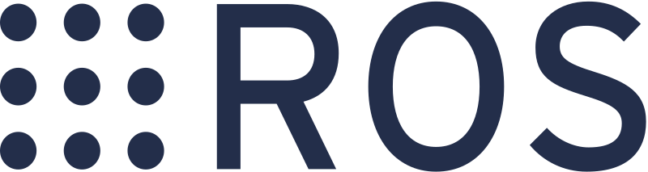
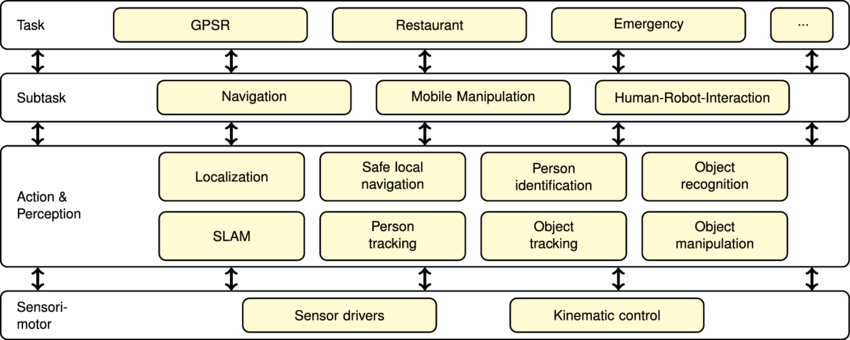

<!--_class: invert -->
# Hello everyone :robot:
Welcome to METR4202 pracs!

---
<!-- backgroundColor: beige -->
### What are pracs about?
- Learning "Robot Operating System" (ROS) and other *practical* robotics skills to compliment theory
- Making progress on and asking questions about your projects

--- 
<!-- class: smol -->
## Overall Learning Objectives
### Learning ROS
- Understand what **Robot Operating System** (ROS) is and what it is used for in robotics
- Employ the basic concepts of ROS such as topics and nodes in order to create **modular components** of robotics software  
- **Understand the different subtasks** that exists in common robotics problems such as pick-and-place and how they fit togther in ROS

---
## Learning Objectives - Prac 1
- Understand ROS **topics**, **publishers** and **subscribers**, and **Msgs** for communicated packed data around in a modular and extensible way
- Understand **Raspberry Pis**, the **Linux** operating system, the **Python** language and how they fit with ROS
- Understand an overview of the **METR4202 project** this semester, what will be done and how these pracs help you
---
<!--backgroundColor: default -->
<!-- _class: big invert -->
# What is ROS?
It stands for **Robot Operating System**

It is not an operating system :thinking: 

---
<!-- _class: big 
backgroundColor: beige -->

is a
### communication framework

---
# Robots are complicated

---
<!--class:  --> 
# ROS provides
- **Topics**, abstract channels on which to communicate data
- **Nodes**, programs which read or write data to topics 
- **Msg types**, the data structures associated with topics that define the format and contents of messages

So a node **publishes** or **subscribes** to data of a particular Msg type on a topic

---
# Raspberry Pi
If you don't already know what a Raspberry Pi is, it is a **single board computer**. It has an ARM architecture Cortex-A CPU and everything it needs as a computer is on a single PCB.

It runs the **Linux** operating system (usually) and is a fully featured computer. 

---
# Linux  
Linux is an **open-source** operating system. ROS is, for the most part, intimately linked to Linux (although you can get it to run on other OSes).

ROS hijacks the Linux "networking stack" for communication and usually assumes it's running on **Ubunutu**, a particular distribution of Linux. 

---
### A reference for learning software
### https://tinyurl.com/metr4202resources

---
## The big one
# The METR4202 Project
Cue relevant document

